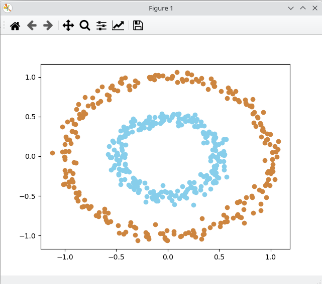
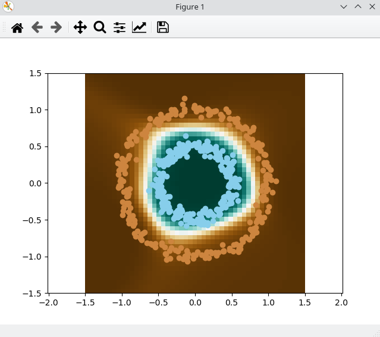
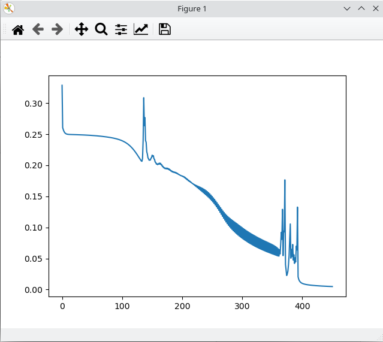

# Neural-Network
This repository shows an example of a simple **neural network** implementation in python to solve a circle ***clustering*** problem.

The objective of this repository is the understanding of the **Backpropagation** algorithm, a key algorithm for the development of neural networks. This algorithm calculates the error of the last layer (consequence of ***forward passing***) and distributes it to the previous layers. But this distribution will not be the same for all the neurons of the previous layer. This distribution is made according to the **weight** that each neuron has had in the final result. Thus recursively the error propagates from the last layer to the first one.

Once the error imputed to each neuron has been calculated, we can calculate the **gradient** by multiplying this error by the partial derivatives of the bias variable and the weights variable respectively (***chain rule***). Thus in each iteration of Backpropagation we can adjust the parameters of the neurons by applying **gradient descent** and thus train the model in an efficient way.

It should be noted that in this explanation we will not deal with the mathematical calculations of the partial derivatives involved in the algorithm. You can look at the code and get it from there. But it is better to stay with the intuition and see in a visual way how this adjustment of the parameters is done and how the error (defined in the cost function) decreases in each iteration.

The topology used is quite simple. 3 layers with 4, 8 and 1 output neuron respectively. The input of the network will be two connections, the coordinates of each point that make up the circle. And the output will be a number for each pair of coordinates, 0 or 1.

Prediction of the points that make up the different circles after the training process. As we can see, the error is minimal:

The evolution of the error (defined in the cost function) during the training process is shown below:

